# ArgusOps — AI Infrastructure & Repository Investigator
## Architecture Specification v2.0

**Status:** Draft — Architecture Review  
**Authors:** Principal Architecture  
**Date:** 2026-06-24  
**Supersedes:** `ARCHITECTURE.md` (v1 — SSH + PAT model)

---

## Table of Contents

1. [Executive Summary](#1-executive-summary)
2. [Product Architecture](#2-product-architecture)
3. [High-Level Design (HLD)](#3-high-level-design-hld)
4. [Low-Level Design (LLD)](#4-low-level-design-lld)
5. [Database Schema](#5-database-schema)
6. [Agent Architecture](#6-agent-architecture)
7. [Backend Architecture](#7-backend-architecture)
8. [Frontend Architecture](#8-frontend-architecture)
9. [API Contracts](#9-api-contracts)
10. [Sequence Diagrams](#10-sequence-diagrams)
11. [Migration Strategy](#11-migration-strategy)
12. [Implementation Plan](#12-implementation-plan)
13. [Folder Structure](#13-folder-structure)
14. [Development Phases](#14-development-phases)
15. [Risk Analysis](#15-risk-analysis)
16. [Scalability Plan](#16-scalability-plan)

---

## 1. Executive Summary

### 1.1 Product Pivot

ArgusOps evolves from **AI Debug Investigator** (manual GitHub PAT + SSH VPS credentials) into an **AI Infrastructure & Repository Investigator** that:

- Connects to source control via **OAuth** (GitHub, GitLab, Bitbucket)
- Connects to infrastructure via a **lightweight Go agent** (no stored passwords)
- Runs **investigations** that correlate repository intelligence with live infrastructure telemetry and logs
- Delivers structured reports with root cause, evidence, and remediation guidance

### 1.2 Architectural Shifts

| Dimension | v1 (Current) | v2 (Target) |
|-----------|--------------|-------------|
| Repository access | Manual PAT, per-user/per-repo encrypted tokens | OAuth integrations, provider abstraction, token refresh |
| Infrastructure access | Backend SSH with stored credentials | Outbound agent WebSocket, command whitelist |
| Job execution | In-process on Express API | Dedicated worker + agent command bus |
| Onboarding | 2-step wizard (PAT + VPS password) | Integrations hub → OAuth → agent install |
| Trust boundary | Backend holds all secrets | Backend holds OAuth tokens; agents hold only agent JWT |
| Scaling bottleneck | SSH connection pool per request | Persistent agent connections, horizontal API/worker scale |

### 1.3 Core Design Principles

1. **No password storage** — SSH passwords, root credentials, and provider passwords are never persisted.
2. **Least privilege** — OAuth scopes are minimal; agent commands are whitelist-only.
3. **Outbound-only agents** — Agents initiate connections to the control plane (firewall-friendly).
4. **Provider extensibility** — Repository and infrastructure integrations use plugin interfaces.
5. **Immutable investigations** — Each investigation produces an append-only audit trail.
6. **Encrypt at rest** — OAuth tokens encrypted AES-256-GCM (reuse existing `encryption.ts` pattern).

---

## 2. Product Architecture

### 2.1 User Journey

```
Register → Login → Integrations Hub
                        ├── Connect Repositories (OAuth)
                        │       └── Select repos to monitor
                        └── Connect Infrastructure (Agent)
                                └── Install agent on each server
                                        └── Investigations
```

### 2.2 Capability Domains

```
┌─────────────────────────────────────────────────────────────────────────┐
│                         ArgusOps Control Plane                          │
├─────────────────┬─────────────────────┬─────────────────────────────────┤
│  Identity &     │  Repository         │  Infrastructure                 │
│  Access         │  Intelligence       │  Intelligence                   │
│                 │                     │                                 │
│  • Registration │  • OAuth providers  │  • Agent registration           │
│  • Login/JWT    │  • Repo sync/index  │  • Heartbeats & metrics         │
│  • RBAC (future)│  • Code search      │  • Log/metric collection        │
│  • Audit logs   │  • PR/commit intel  │  • Whitelisted command exec     │
├─────────────────┴─────────────────────┴─────────────────────────────────┤
│                      Investigation Engine                               │
│  • Natural language query → structured investigation plan               │
│  • Correlates repo signals + agent telemetry + logs                     │
│  • LLM synthesis → investigation_reports                                │
└─────────────────────────────────────────────────────────────────────────┘
```

### 2.3 Component Topology

```
                    ┌──────────────────┐
                    │   Web Frontend   │
                    │   (Next.js 15)   │
                    └────────┬─────────┘
                             │ HTTPS /api/*
                             ▼
┌──────────────┐    ┌──────────────────┐    ┌──────────────────┐
│ OAuth        │◄──►│  API Gateway     │◄──►│  PostgreSQL      │
│ Providers    │    │  (Express)       │    │                  │
│ GitHub/GitLab│    └────────┬─────────┘    └──────────────────┘
│ Bitbucket    │             │
└──────────────┘             │ enqueue jobs
                             ▼
                    ┌──────────────────┐         ┌──────────────────┐
                    │  Worker Service  │◄───────►│  Redis (BullMQ)  │
                    └────────┬─────────┘         └──────────────────┘
                             │
                             │ WebSocket command bus
                             ▼
                    ┌──────────────────┐
                    │  Agent Gateway   │◄──── WSS /agent/ws
                    │  (WS server)     │
                    └────────┬─────────┘
                             │
              ┌──────────────┼──────────────┐
              ▼              ▼              ▼
        ┌──────────┐  ┌──────────┐  ┌──────────┐
        │ Go Agent │  │ Go Agent │  │ Go Agent │
        │ EC2      │  │ Hetzner  │  │ Hostinger│
        └──────────┘  └──────────┘  └──────────┘
```

### 2.4 Investigation Model

An **Investigation** replaces the v1 **Incident** concept with richer structure:

- **Trigger:** User question (e.g., "Why is production API failing?")
- **Scope:** One or more repositories + one or more agents (servers)
- **Execution:** Worker decomposes into `investigation_steps` (repo queries, agent commands)
- **Output:** `investigation_reports` with findings, evidence links, confidence, timeline

---

## 3. High-Level Design (HLD)

### 3.1 System Context Diagram

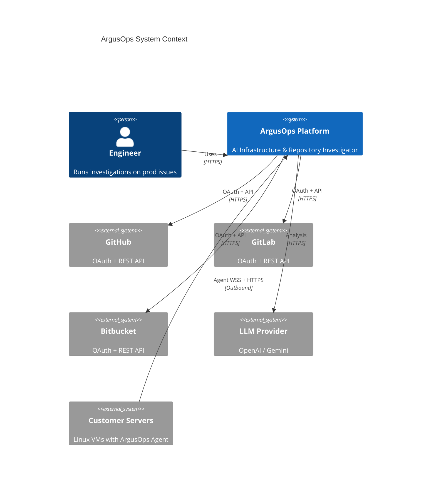

### 3.2 Container Diagram

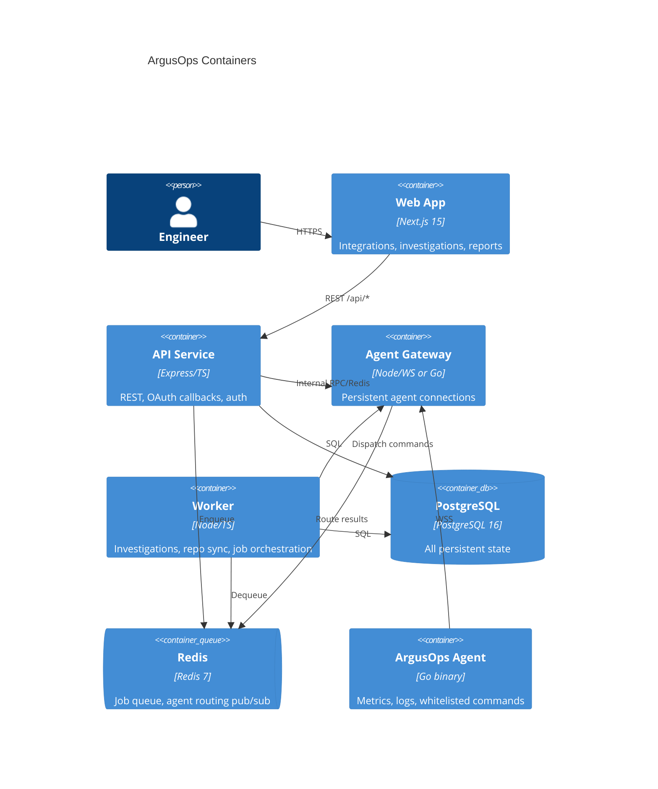

### 3.3 Data Flow — Investigation

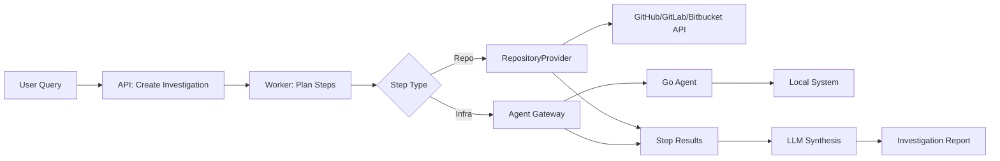

### 3.4 Security Zones

| Zone | Components | Exposure | Secrets |
|------|------------|----------|---------|
| Public | Frontend, OAuth callbacks | Internet | None |
| Application | API, Worker, Agent Gateway | Internal + public API | Encrypted OAuth tokens, JWT signing keys |
| Customer | Go Agent | Customer VPC | Agent JWT only |
| Data | PostgreSQL, Redis | Private network | Encryption key in KMS/env |

---

## 4. Low-Level Design (LLD)

### 4.1 Repository Provider Pattern

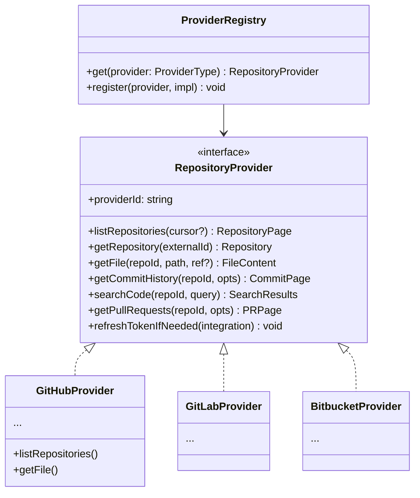

**Provider resolution flow:**

1. Load `repository_integrations` for user + provider
2. Decrypt access token; refresh if `expires_at < now + 5min`
3. Instantiate provider from `ProviderRegistry`
4. Execute operation; map provider-native response → canonical DTO

**Canonical DTOs** (backend `types/repository-provider.ts`):

```typescript
interface Repository {
  externalId: string;
  fullName: string;
  defaultBranch: string;
  private: boolean;
  htmlUrl: string;
}

interface FileContent {
  path: string;
  content: string;
  encoding: 'utf-8' | 'base64';
  sha: string;
}

interface Commit {
  sha: string;
  message: string;
  author: string;
  committedAt: string;
}
```

### 4.2 Agent Gateway LLD

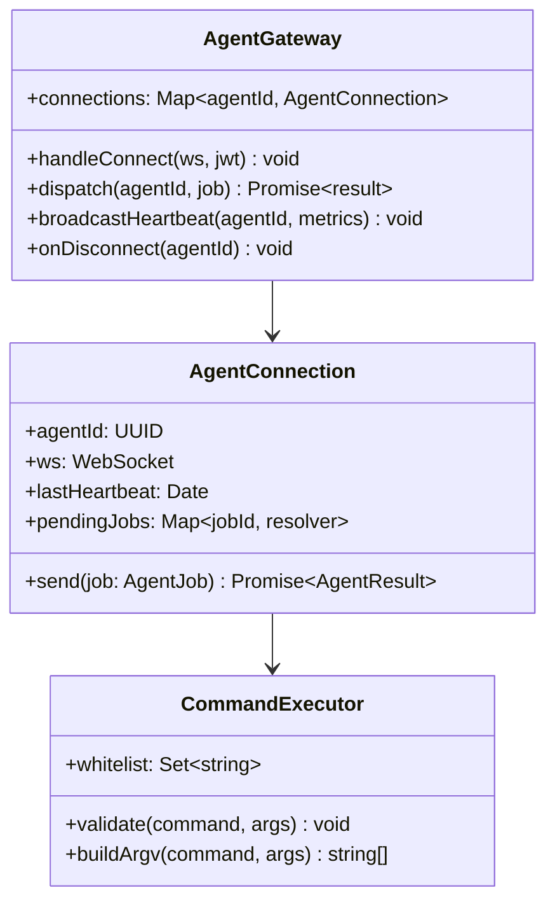

**Job lifecycle:**

1. Worker publishes `agent:dispatch:{agentId}` to Redis with job payload
2. Agent Gateway instance holding connection receives, sends WS `job` frame
3. Agent executes whitelisted command, streams `job_chunk` frames
4. Agent sends `job_complete` with exit code + aggregated output
5. Gateway resolves promise, writes `investigation_steps.result`
6. Timeout default: 120s (configurable per command type)

### 4.3 WebSocket Protocol

**Endpoint:** `wss://api.argusops.ai/agent/ws`  
**Auth:** `Authorization: Bearer <agent_jwt>` on connection upgrade

#### Frame envelope

```json
{
  "type": "heartbeat | job | job_chunk | job_complete | job_error | ping | pong | ack",
  "id": "uuid",
  "ts": "2026-06-24T12:00:00Z",
  "payload": {}
}
```

#### Message types

| Type | Direction | Purpose |
|------|-----------|---------|
| `ping` | Server → Agent | Keepalive (every 15s) |
| `pong` | Agent → Server | Keepalive response |
| `heartbeat` | Agent → Server | Metrics payload (also via REST fallback) |
| `job` | Server → Agent | Command execution request |
| `job_chunk` | Agent → Server | Streaming stdout/stderr |
| `job_complete` | Agent → Server | Final result |
| `job_error` | Either | Protocol or execution failure |
| `ack` | Either | Confirm receipt of critical frames |

#### Reconnection strategy

- Agent: exponential backoff `1s → 2s → 4s → ... → 60s cap`
- On reconnect: present same agent JWT (rotated only on explicit revoke)
- Server: mark agent `status = disconnected` after 90s without heartbeat
- Undelivered jobs: requeued if agent reconnects within 5min; otherwise `step.status = failed`

### 4.4 Command Whitelist

| Command | Args Schema | Max Timeout | Notes |
|---------|-------------|-------------|-------|
| `docker ps` | `{ all?: boolean }` | 30s | No arbitrary flags |
| `docker inspect` | `{ containerId: string }` | 30s | ID validated `^[a-f0-9]{12,64}$` |
| `docker logs` | `{ containerId, tail?: number }` | 60s | `tail` max 1000 |
| `journalctl` | `{ unit?: string, tail?: number, since?: string }` | 60s | `--no-pager` forced |
| `systemctl status` | `{ unit: string }` | 30s | Unit name sanitized |
| `df` | `{ path?: string }` | 15s | `-h` forced |
| `free` | `{ unit?: 'm' }` | 15s | `-m` forced |
| `netstat` | `{ flags?: 'tuln' }` | 30s | Fixed flags only |
| `ss` | `{ flags?: 'tuln' }` | 30s | Fixed flags only |

**Agent enforcement:** Commands are NOT passed as shell strings. Server sends `{ command: "docker_logs", args: { containerId, tail } }`; agent maps to fixed `exec.Command` with no shell invocation.

### 4.5 OAuth Token Lifecycle

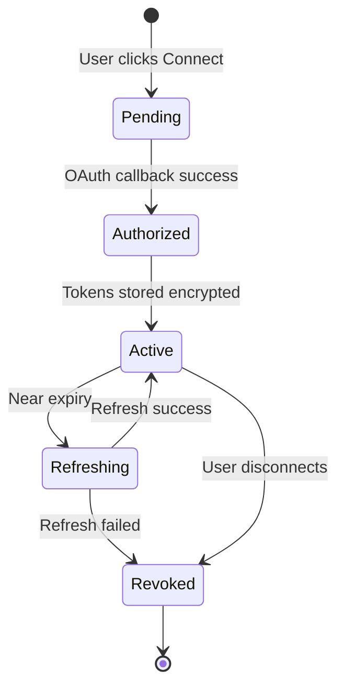

- **Encryption:** Reuse AES-256-GCM (`encryption.ts`)
- **Refresh:** Proactive refresh 5 minutes before expiry via worker cron
- **Revocation:** Delete tokens + mark integrations `status = revoked` + audit log

---

## 5. Database Schema

### 5.1 Entity Relationship Diagram

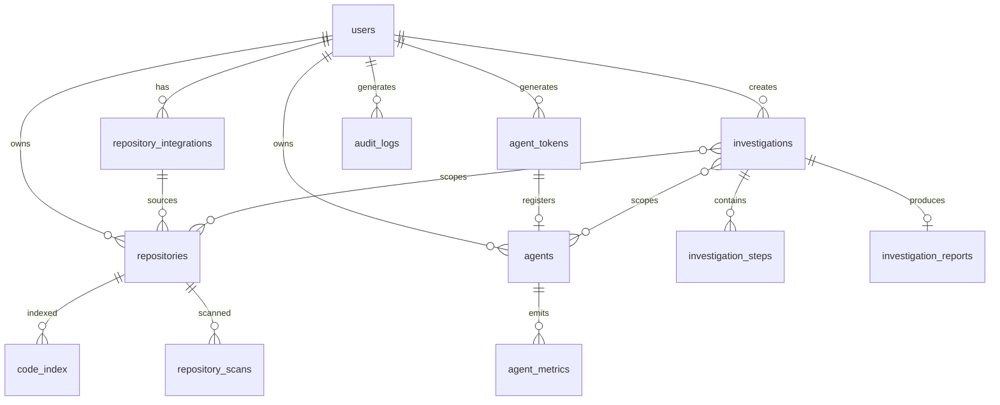

### 5.2 Table Definitions

#### `users` (modified)

| Column | Type | Notes |
|--------|------|-------|
| id | UUID PK | `gen_random_uuid()` |
| email | VARCHAR(255) UNIQUE | |
| password_hash | VARCHAR(255) | bcrypt, 12 rounds |
| name | VARCHAR(255) | |
| created_at | TIMESTAMPTZ | |
| updated_at | TIMESTAMPTZ | |

**Removed in v2:** `github_token_enc` (replaced by `repository_integrations`)

#### `repository_integrations` (new)

| Column | Type | Notes |
|--------|------|-------|
| id | UUID PK | |
| user_id | UUID FK → users | ON DELETE CASCADE |
| provider | VARCHAR(50) | `github`, `gitlab`, `bitbucket` |
| provider_account_id | VARCHAR(255) | Provider's user/org ID |
| provider_account_login | VARCHAR(255) | Display name |
| access_token_enc | TEXT NOT NULL | AES-256-GCM |
| refresh_token_enc | TEXT | Nullable (GitHub apps may not issue) |
| scopes | TEXT[] | Granted scopes |
| expires_at | TIMESTAMPTZ | Nullable if non-expiring |
| status | VARCHAR(50) | `active`, `revoked`, `error` |
| last_synced_at | TIMESTAMPTZ | |
| created_at | TIMESTAMPTZ | |
| updated_at | TIMESTAMPTZ | |

**Indexes:** `UNIQUE(user_id, provider, provider_account_id)`, `INDEX(provider, status)`

#### `repositories` (modified)

| Column | Type | Notes |
|--------|------|-------|
| id | UUID PK | |
| user_id | UUID FK | |
| integration_id | UUID FK → repository_integrations | Replaces raw token |
| provider | VARCHAR(50) | Denormalized for queries |
| external_id | VARCHAR(255) | Provider repo ID |
| full_name | VARCHAR(512) | `owner/name` |
| default_branch | VARCHAR(100) | |
| html_url | VARCHAR(512) | |
| local_path | VARCHAR(512) | Clone path (optional) |
| clone_status | VARCHAR(50) | `pending`, `cloning`, `ready`, `failed` |
| index_status | VARCHAR(50) | |
| file_count | INTEGER | |
| failure_reason | TEXT | |
| last_synced_at | TIMESTAMPTZ | |
| created_at | TIMESTAMPTZ | |

**Removed:** `github_token_enc`, `repo_url`, `owner`, `name` (replaced by `full_name`, `external_id`)  
**Indexes:** `UNIQUE(integration_id, external_id)`

#### `agent_tokens` (new)

| Column | Type | Notes |
|--------|------|-------|
| id | UUID PK | |
| user_id | UUID FK | |
| token_hash | VARCHAR(128) | SHA-256 of one-time token |
| label | VARCHAR(255) | User-friendly name |
| expires_at | TIMESTAMPTZ | Default 24h if unused |
| used_at | TIMESTAMPTZ | Set on registration |
| revoked_at | TIMESTAMPTZ | |
| created_at | TIMESTAMPTZ | |

**Indexes:** `INDEX(token_hash) WHERE revoked_at IS NULL`

#### `agents` (new)

| Column | Type | Notes |
|--------|------|-------|
| id | UUID PK | |
| user_id | UUID FK | |
| agent_token_id | UUID FK | Token used to register |
| hostname | VARCHAR(255) | |
| display_name | VARCHAR(255) | User-editable |
| os | VARCHAR(100) | e.g., `ubuntu-22.04` |
| kernel | VARCHAR(255) | |
| agent_version | VARCHAR(50) | |
| status | VARCHAR(50) | `pending`, `connected`, `disconnected`, `revoked` |
| last_seen_at | TIMESTAMPTZ | |
| jwt_subject | VARCHAR(255) | For agent JWT claims |
| metadata | JSONB | Cloud provider hints, region, tags |
| created_at | TIMESTAMPTZ | |
| updated_at | TIMESTAMPTZ | |

**Indexes:** `INDEX(user_id, status)`, `INDEX(last_seen_at)`

#### `agent_metrics` (new, partitioned)

| Column | Type | Notes |
|--------|------|-------|
| id | BIGSERIAL | |
| agent_id | UUID FK | |
| recorded_at | TIMESTAMPTZ | |
| cpu_percent | REAL | |
| memory_used_mb | INTEGER | |
| memory_total_mb | INTEGER | |
| disk_used_pct | REAL | |
| load_1 | REAL | |
| load_5 | REAL | |
| load_15 | REAL | |
| docker_containers | JSONB | Snapshot of container states |

**Indexes:** `INDEX(agent_id, recorded_at DESC)`  
**Retention:** 7 days hot → aggregate to hourly rollups → 90 days  
**Partitioning:** By `recorded_at` (daily partitions)

#### `investigations` (replaces `incidents`)

| Column | Type | Notes |
|--------|------|-------|
| id | UUID PK | |
| user_id | UUID FK | |
| title | VARCHAR(512) | User question or auto-generated |
| query | TEXT | Original natural language query |
| status | VARCHAR(50) | `pending`, `planning`, `running`, `completed`, `failed` |
| repository_ids | UUID[] | Scoped repos |
| agent_ids | UUID[] | Scoped agents |
| progress_step | VARCHAR(100) | Current step name |
| created_at | TIMESTAMPTZ | |
| completed_at | TIMESTAMPTZ | |

#### `investigation_steps` (new)

| Column | Type | Notes |
|--------|------|-------|
| id | UUID PK | |
| investigation_id | UUID FK | |
| step_order | INTEGER | |
| step_type | VARCHAR(50) | `repo_query`, `agent_command`, `llm_reasoning` |
| description | TEXT | Human-readable step |
| status | VARCHAR(50) | `pending`, `running`, `completed`, `failed` |
| input | JSONB | Command or query params |
| result | JSONB | Output data |
| error | TEXT | |
| started_at | TIMESTAMPTZ | |
| completed_at | TIMESTAMPTZ | |
| duration_ms | INTEGER | |

#### `investigation_reports` (replaces `analysis_reports`)

| Column | Type | Notes |
|--------|------|-------|
| id | UUID PK | |
| investigation_id | UUID FK UNIQUE | |
| root_cause | TEXT | |
| confidence_score | REAL | 0.0–1.0 |
| summary | TEXT | Executive summary |
| findings | JSONB | Structured findings array |
| affected_files | JSONB | |
| affected_commits | JSONB | |
| timeline | JSONB | |
| recommendations | JSONB | |
| evidence | JSONB | Links to step results |
| llm_model | VARCHAR(100) | |
| llm_raw_response | JSONB | |
| created_at | TIMESTAMPTZ | |

#### `audit_logs` (new)

| Column | Type | Notes |
|--------|------|-------|
| id | BIGSERIAL | |
| user_id | UUID FK | Nullable for system events |
| actor_type | VARCHAR(50) | `user`, `agent`, `system` |
| actor_id | VARCHAR(255) | |
| action | VARCHAR(100) | `oauth.connect`, `agent.register`, `investigation.create`, etc. |
| resource_type | VARCHAR(100) | |
| resource_id | UUID | |
| metadata | JSONB | |
| ip_address | INET | |
| created_at | TIMESTAMPTZ | |

**Indexes:** `INDEX(user_id, created_at DESC)`, `INDEX(action, created_at DESC)`

### 5.3 Deprecated Tables

| Table | Fate |
|-------|------|
| `vps_connections` | Deprecated → migrate to `agents`; drop after 90 days |
| `incidents` | Renamed/replaced by `investigations` |
| `analysis_reports` | Replaced by `investigation_reports` |

**Retained:** `code_index`, `repository_scans`, `repository_apis`, `repository_services`, `repository_integrations` (repo intel), `repository_hot_files` — these remain for repository intelligence features.

> **Naming note:** Existing `repository_integrations` table (repo intel) stores detected third-party services (Stripe, etc.). Rename to `repository_detected_integrations` in migration `004` to avoid collision with OAuth `repository_integrations`.

---

## 6. Agent Architecture

### 6.1 Agent Component Diagram

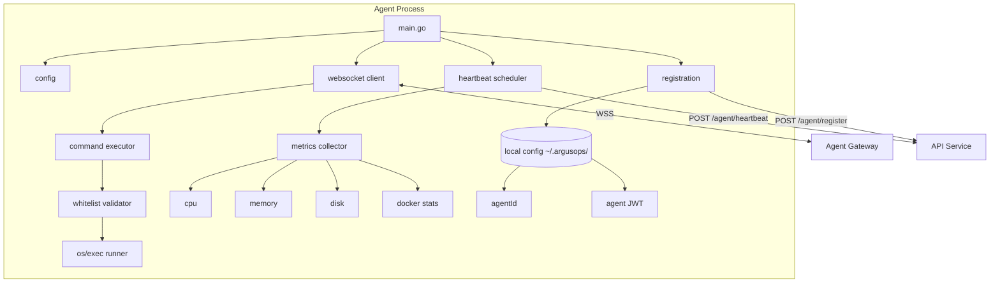

### 6.2 Agent Modules

| Module | Responsibility |
|--------|----------------|
| `cmd/argusops-agent` | Entry point, signal handling (SIGTERM graceful shutdown) |
| `internal/config` | Load/save `~/.argusops/config.yaml` (agentId, jwt, apiUrl) |
| `internal/register` | One-time registration with install token |
| `internal/ws` | WebSocket client, reconnect, frame codec |
| `internal/heartbeat` | 30s ticker, metrics collection, REST fallback |
| `internal/executor` | Whitelist command dispatch, streaming output |
| `internal/metrics` | /proc, docker socket, df, free |
| `internal/install` | Install script logic (systemd unit, user creation) |

### 6.3 Agent Local Storage

**Path:** `/etc/argusops/config.yaml` (root) or `~/.argusops/config.yaml` (user install)

```yaml
api_url: https://api.argusops.ai
agent_id: "uuid"
agent_jwt: "eyJ..."
registered_at: "2026-06-24T12:00:00Z"
```

**File permissions:** `0600`  
**Never stored:** passwords, OAuth tokens, SSH keys

### 6.4 Agent Systemd Unit

```ini
[Unit]
Description=ArgusOps Infrastructure Agent
After=network-online.target
Wants=network-online.target

[Service]
Type=simple
ExecStart=/usr/local/bin/argusops-agent
Restart=always
RestartSec=5
User=argusops
Group=argusops
NoNewPrivileges=true
ProtectSystem=strict
ProtectHome=true
ReadWritePaths=/etc/argusops

[Install]
WantedBy=multi-user.target
```

### 6.5 Install Script Flow

```bash
# curl -fsSL https://agent.argusops.ai/install.sh | bash -s -- <AGENT_TOKEN>

1. Detect OS (ubuntu/debian/centos) + arch (amd64/arm64)
2. Download release binary from CDN
3. Verify SHA256 checksum + optional cosign signature
4. Create argusops user
5. Write config with install token (not yet registered)
6. Run: argusops-agent register --token <TOKEN>
7. Install systemd unit
8. Enable + start service
```

### 6.6 Supported Platforms

| Platform | Install Method | Notes |
|----------|----------------|-------|
| Ubuntu 20.04+ | systemd | Primary target |
| Debian 11+ | systemd | Primary target |
| Hostinger VPS | systemd | Tested on their Ubuntu images |
| AWS EC2 | systemd | Amazon Linux 2023 requires separate build |
| Azure VM | systemd | |
| GCP VM | systemd | |
| Contabo | systemd | Standard Ubuntu |
| Hetzner | systemd | Standard Ubuntu/Debian |

---

## 7. Backend Architecture

### 7.1 Service Decomposition

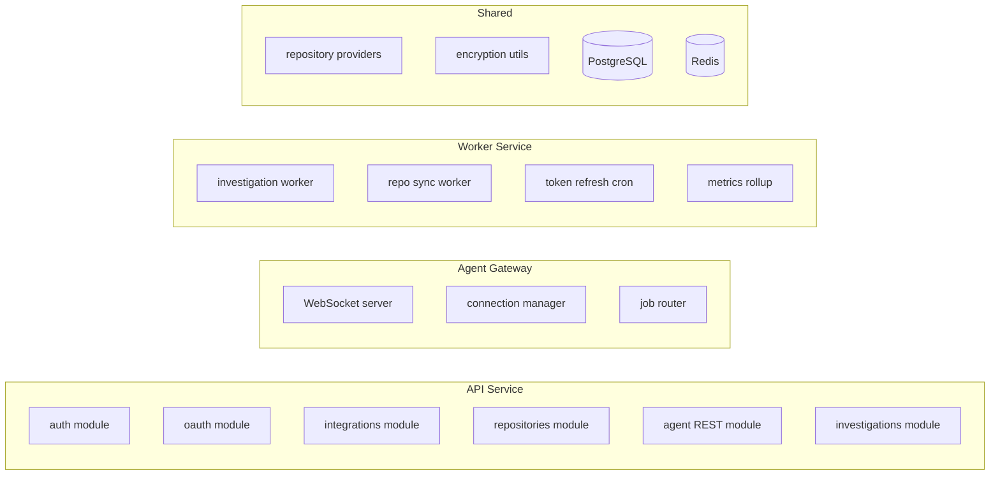

### 7.2 Module Responsibilities

| Module | Routes | Description |
|--------|--------|-------------|
| `auth` | `/api/auth/*` | Registration, login, JWT (unchanged) |
| `oauth` | `/api/oauth/:provider/*` | OAuth initiate + callback |
| `integrations` | `/api/integrations/*` | List, connect, disconnect integrations |
| `repositories` | `/api/repositories/*` | List/select repos, sync, index |
| `agents` | `/api/agents/*` | Token generation, agent management |
| `agent-gateway` | `/agent/ws`, `/agent/register`, `/agent/heartbeat` | Agent-facing endpoints |
| `investigations` | `/api/investigations/*` | CRUD, trigger, status, reports |
| `audit` | internal | Audit log writes on sensitive actions |

### 7.3 Worker Jobs

| Job | Queue | Trigger | Description |
|-----|-------|---------|-------------|
| `investigation:run` | `investigations` | API create | Execute investigation plan |
| `repo:clone` | `repos` | Repo add/sync | Clone + index |
| `repo:scan` | `repos` | Post-clone | Repository intelligence scan |
| `oauth:refresh` | `maintenance` | Cron 5min | Refresh expiring tokens |
| `agent:cleanup` | `maintenance` | Cron 1hr | Mark stale agents disconnected |
| `metrics:rollup` | `maintenance` | Cron 1hr | Aggregate agent_metrics |

### 7.4 Technology Choices

| Component | Technology | Rationale |
|-----------|------------|-----------|
| API | Express + TypeScript | Existing codebase continuity |
| Agent Gateway | **Option A:** Express + `ws` library<br>**Option B:** Dedicated Go service | Start with A; extract to B at 1K+ agents |
| Worker | BullMQ + Redis | Industry standard, retries, dead-letter |
| Agent | Go 1.22+ | Single binary, low memory (~15MB RSS) |
| DB | PostgreSQL 16 | Existing |
| OAuth | `passport` or manual OAuth2 | Provider-specific quirks |

### 7.5 Agent JWT Specification

```json
{
  "sub": "agent:<agent_uuid>",
  "user_id": "<user_uuid>",
  "iat": 1710000000,
  "exp": 1712592000,
  "scope": "agent:heartbeat agent:execute"
}
```

- **Issued on:** successful registration
- **TTL:** 30 days (auto-renewed on heartbeat if < 7 days remaining)
- **Signing:** HS256 with `AGENT_JWT_SECRET` (separate from user JWT)
- **Revocation:** `agents.status = revoked` checked on every request

---

## 8. Frontend Architecture

### 8.1 Route Map

| Route | Page | Auth | Purpose |
|-------|------|------|---------|
| `/register` | Register | Public | Account creation |
| `/login` | Login | Public | Authentication |
| `/integrations` | Integrations Hub | Protected | Central setup page |
| `/integrations/repositories` | Repo Integrations | Protected | OAuth connect, repo selection |
| `/integrations/infrastructure` | Infra Integrations | Protected | Agent tokens, install commands |
| `/investigations` | Investigation List | Protected | History |
| `/investigations/new` | New Investigation | Protected | Query + scope selection |
| `/investigations/[id]` | Investigation Detail | Protected | Steps, report, evidence |
| `/workspace` | Workspace | Protected | Unified chat + context (evolved) |
| `/account` | Account Settings | Protected | Profile, audit log viewer |

**Deprecated routes:** `/onboarding` → redirect to `/integrations`, `/connect-github`, `/connect-vps` → redirect

### 8.2 Integrations Hub Wireframe (Logical)

```
┌─────────────────────────────────────────────────────────────┐
│  Integrations                                               │
├──────────────────────────┬──────────────────────────────────┤
│  Repository Connections  │  Infrastructure Agents           │
│                          │                                  │
│  [GitHub]    Connected ✓ │  production-api    ● Connected   │
│  [GitLab]    Connect →   │  staging-db        ○ Disconnected│
│  [Bitbucket] Connect →   │                                  │
│                          │  [+ Add Server]                  │
│  3 repositories selected │                                  │
│  [Manage Repos →]        │                                  │
├──────────────────────────┴──────────────────────────────────┤
│  Ready to investigate: ✓ Repos  ✓ Agents                    │
│  [Start Investigation →]                                    │
└─────────────────────────────────────────────────────────────┘
```

### 8.3 State Management

| Concern | Solution |
|---------|----------|
| Server state | TanStack Query (existing) |
| Auth token | localStorage → **migrate to httpOnly cookie** (security improvement) |
| Integration status | `useIntegrationsStatus()` hook (replaces `useSetupStatus`) |
| Investigation streaming | WebSocket or SSE to frontend for live step progress |
| Optimistic UI | Repo selection, agent naming |

### 8.4 Key Frontend Components

```
components/
├── integrations/
│   ├── IntegrationsHub.tsx
│   ├── ProviderCard.tsx          # GitHub/GitLab/Bitbucket
│   ├── OAuthConnectButton.tsx
│   ├── RepositorySelector.tsx
│   ├── AgentTokenDialog.tsx
│   ├── InstallCommandCopy.tsx
│   └── AgentStatusBadge.tsx
├── investigations/
│   ├── InvestigationForm.tsx
│   ├── InvestigationTimeline.tsx
│   ├── StepProgress.tsx
│   └── ReportViewer.tsx
└── layout/
    └── SetupGuard.tsx            # Replaces onboarding gate
```

### 8.5 Setup Guard Logic

```typescript
// canUseWorkspace = hasActiveRepoIntegration && hasConnectedAgent
// Redirect to /integrations if false
```

---

## 9. API Contracts

### 9.1 OAuth Endpoints

#### `GET /api/oauth/:provider/authorize`

**Params:** `provider` = `github` | `gitlab` | `bitbucket`  
**Query:** `redirect_uri` (optional, must be allowlisted)  
**Response:** `302 Redirect` to provider OAuth page

#### `GET /api/oauth/:provider/callback`

**Query:** `code`, `state`  
**Response:** `302 Redirect` to `/integrations/repositories?connected=<provider>`

---

### 9.2 Integration Endpoints

#### `GET /api/integrations/status`

```json
{
  "repositories": {
    "github": { "connected": true, "account": "acme-org", "repoCount": 3 },
    "gitlab": { "connected": false },
    "bitbucket": { "connected": false }
  },
  "infrastructure": {
    "agentCount": 2,
    "connectedCount": 1,
    "agents": [
      { "id": "uuid", "displayName": "production-api", "status": "connected", "lastSeenAt": "..." }
    ]
  },
  "canStartInvestigations": true,
  "nextStep": null
}
```

#### `DELETE /api/integrations/repositories/:provider`

Disconnect OAuth integration. Revokes tokens, marks repos inactive.

---

### 9.3 Repository Endpoints

#### `GET /api/repositories/available`

List repos from all connected providers (paginated).

```json
{
  "items": [
    {
      "externalId": "123",
      "fullName": "acme/api",
      "provider": "github",
      "private": true,
      "defaultBranch": "main"
    }
  ],
  "cursor": "abc"
}
```

#### `POST /api/repositories`

```json
// Request
{ "integrationId": "uuid", "externalId": "123" }

// Response 201
{ "id": "uuid", "fullName": "acme/api", "cloneStatus": "pending" }
```

---

### 9.4 Agent Endpoints

#### `POST /api/agents/tokens`

```json
// Request
{ "label": "production-api" }

// Response 201
{
  "tokenId": "uuid",
  "installCommand": "curl -fsSL https://agent.argusops.ai/install.sh | bash -s -- argops_xxxx",
  "expiresAt": "2026-06-25T12:00:00Z"
}
```

> Token shown **once**. Only `token_hash` stored server-side.

#### `POST /agent/register` (agent-facing, no user JWT)

```json
// Request
{
  "token": "argops_xxxx",
  "hostname": "prod-api-01",
  "os": "ubuntu-22.04",
  "kernel": "5.15.0-91-generic",
  "version": "1.0.0"
}

// Response 201
{
  "agentId": "uuid",
  "jwt": "eyJ...",
  "wsUrl": "wss://api.argusops.ai/agent/ws"
}
```

#### `POST /agent/heartbeat` (agent JWT)

```json
// Request
{
  "cpu": 23.5,
  "memory": { "usedMb": 2048, "totalMb": 8192 },
  "disk": { "usedPct": 67.2 },
  "load": { "1": 0.5, "5": 0.3, "15": 0.2 },
  "dockerContainers": [
    { "id": "abc123", "name": "api", "status": "running", "image": "acme/api:1.2.3" }
  ]
}

// Response 200
{ "ok": true, "jwtRenewed": false }
```

#### `GET /api/agents`

```json
{
  "items": [
    {
      "id": "uuid",
      "displayName": "production-api",
      "hostname": "prod-api-01",
      "status": "connected",
      "os": "ubuntu-22.04",
      "agentVersion": "1.0.0",
      "lastSeenAt": "2026-06-24T12:00:00Z",
      "latestMetrics": { "cpu": 23.5, "memoryUsedMb": 2048 }
    }
  ]
}
```

---

### 9.5 Investigation Endpoints

#### `POST /api/investigations`

```json
// Request
{
  "query": "Why is production API failing?",
  "repositoryIds": ["uuid"],
  "agentIds": ["uuid"]
}

// Response 202
{
  "id": "uuid",
  "status": "pending",
  "statusUrl": "/api/investigations/uuid"
}
```

#### `GET /api/investigations/:id`

```json
{
  "id": "uuid",
  "title": "Why is production API failing?",
  "status": "running",
  "progressStep": "Checking docker logs on production-api",
  "steps": [
    {
      "id": "uuid",
      "stepOrder": 1,
      "stepType": "agent_command",
      "description": "docker ps on production-api",
      "status": "completed",
      "durationMs": 1200
    }
  ],
  "report": null
}
```

#### `GET /api/investigations/:id/stream` (SSE)

```
event: step_update
data: {"stepId":"uuid","status":"running"}

event: complete
data: {"reportId":"uuid"}
```

---

## 10. Sequence Diagrams

### 10.1 GitHub OAuth Connection

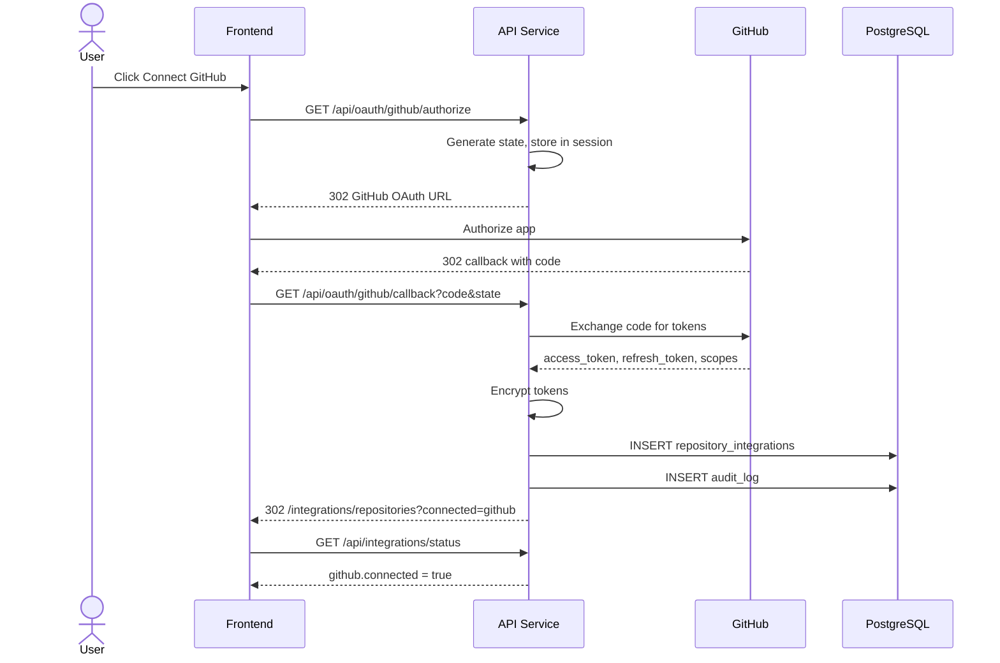

### 10.2 Agent Registration

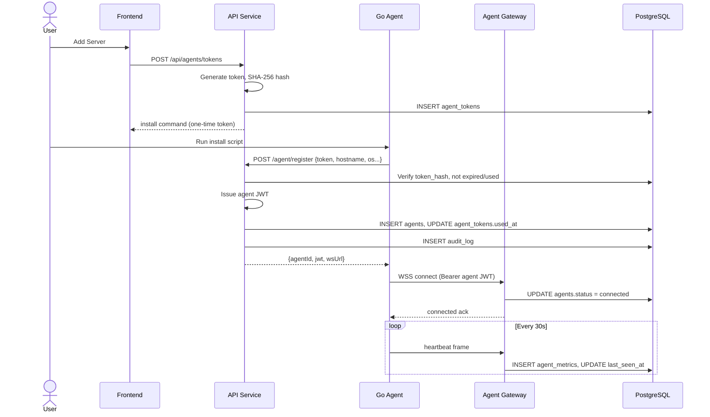

### 10.3 Investigation Execution

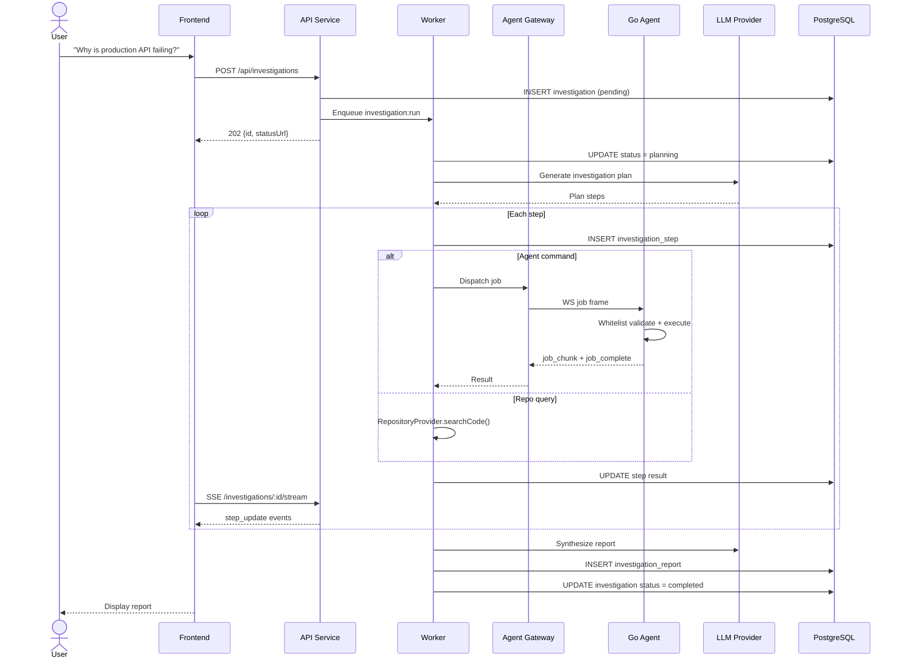

### 10.4 Agent Reconnection

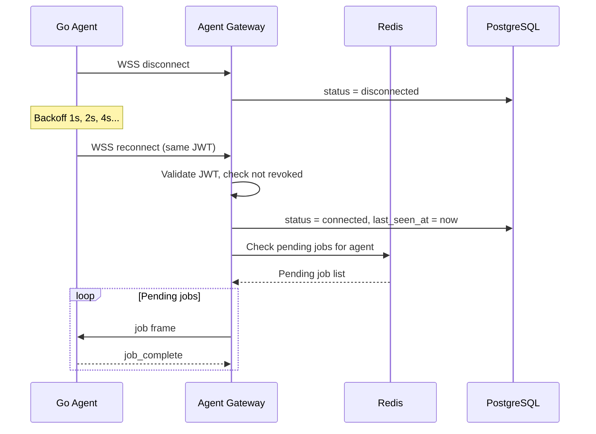

---

## 11. Migration Strategy

### 11.1 Migration Phases

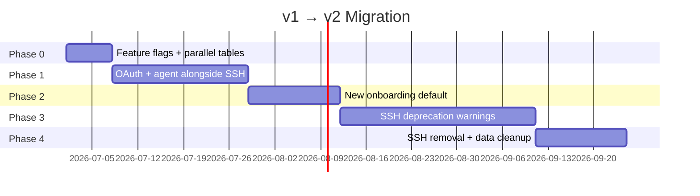

### 11.2 Database Migration (`004_v2_integrations.sql`)

1. Create new tables: `repository_integrations`, `agent_tokens`, `agents`, `agent_metrics`, `investigations`, `investigation_steps`, `investigation_reports`, `audit_logs`
2. Rename `repository_integrations` → `repository_detected_integrations`
3. Add `integration_id`, `provider`, `external_id` to `repositories`; backfill from existing `owner`/`name` as `full_name`
4. Create `investigations` from `incidents` data mapping
5. Mark `vps_connections` as `deprecated_at = NOW()`
6. Drop `users.github_token_enc` after OAuth migration complete

### 11.3 User Migration Path

| User State | Action |
|------------|--------|
| Has PAT, no OAuth | Show banner: "Connect GitHub via OAuth to continue receiving updates" |
| Has VPS credentials | Show banner: "Install agent on your servers by [date]" with guided wizard |
| New user | v2 flow only (no PAT/VPS options) |
| PAT + OAuth coexist | OAuth takes precedence; PAT used as fallback during Phase 1 only |

### 11.4 Data Migration Scripts

```
scripts/migrate/
├── 01_create_v2_tables.sql
├── 02_backfill_repositories.ts      # owner/name → full_name, external_id
├── 03_migrate_incidents.ts          # incidents → investigations
├── 04_migrate_analysis_reports.ts   # analysis_reports → investigation_reports
└── 05_deprecate_vps.ts              # Export VPS list for user reference
```

### 11.5 Feature Flags

| Flag | Default | Description |
|------|---------|-------------|
| `FF_OAUTH_GITHUB` | `true` | Enable GitHub OAuth |
| `FF_OAUTH_GITLAB` | `false` | GitLab (Phase 2) |
| `FF_OAUTH_BITBUCKET` | `false` | Bitbucket (Phase 2) |
| `FF_AGENT_INFRA` | `true` | Agent-based infrastructure |
| `FF_SSH_VPS` | `true` → `false` | Legacy SSH (deprecated) |
| `FF_INVESTIGATIONS_V2` | `true` | New investigation engine |

### 11.6 API Compatibility

- v1 endpoints (`/api/vps/*`, `/api/github/connect`) return `Deprecation: true` header during Phase 3
- v1 endpoints removed in Phase 4
- Frontend detects capabilities via `GET /api/integrations/status`

### 11.7 Rollback Plan

- Feature flags allow instant rollback to SSH path
- New tables are additive until Phase 4
- Agent gateway is independent service — can be disabled without affecting repo OAuth
- Keep `vps_connections` table read-only for 90 days post-migration

---

## 12. Implementation Plan

### 12.1 Workstreams

| WS | Name | Owner | Dependencies |
|----|------|-------|--------------|
| WS-1 | Database & migrations | Backend | None |
| WS-2 | OAuth providers (GitHub first) | Backend | WS-1 |
| WS-3 | RepositoryProvider abstraction | Backend | WS-2 |
| WS-4 | Go Agent MVP | Agent | WS-1 |
| WS-5 | Agent Gateway + WebSocket | Backend | WS-4 |
| WS-6 | Worker + investigation engine | Backend | WS-3, WS-5 |
| WS-7 | Frontend integrations hub | Frontend | WS-2, WS-4 |
| WS-8 | Security & audit | Backend | WS-1 |
| WS-9 | Migration tooling | Backend | WS-1 |
| WS-10 | Install script + CDN | DevOps | WS-4 |

### 12.2 Detailed Task Breakdown

#### WS-1: Database (Week 1)
- [ ] Write migration `004_v2_integrations.sql`
- [ ] Rename repo intel `repository_integrations` table
- [ ] Add TypeScript types for all new entities
- [ ] Seed data for development

#### WS-2: OAuth — GitHub (Week 1–2)
- [ ] Register GitHub OAuth App
- [ ] Implement `GET /api/oauth/github/authorize` + callback
- [ ] Token encryption + storage
- [ ] Token refresh cron job
- [ ] `DELETE` disconnect endpoint
- [ ] Audit log integration

#### WS-3: RepositoryProvider (Week 2–3)
- [ ] Define `RepositoryProvider` interface
- [ ] Implement `GitHubProvider` (all 6 methods)
- [ ] `ProviderRegistry` with factory
- [ ] Refactor existing `github.service.ts` to use provider
- [ ] Update repo clone/sync to use integration tokens
- [ ] Stub `GitLabProvider`, `BitbucketProvider`

#### WS-4: Go Agent MVP (Week 2–4)
- [ ] Project scaffold (`agent/` module)
- [ ] Registration flow
- [ ] Config file management
- [ ] Heartbeat + metrics collection
- [ ] WebSocket client with reconnect
- [ ] Command executor with whitelist
- [ ] systemd unit + install script
- [ ] Cross-compile CI (linux/amd64, linux/arm64)

#### WS-5: Agent Gateway (Week 3–4)
- [ ] WebSocket server on `/agent/ws`
- [ ] Agent JWT middleware
- [ ] Connection manager
- [ ] Job dispatch + result routing via Redis
- [ ] REST heartbeat fallback endpoint
- [ ] Agent management API

#### WS-6: Investigation Engine (Week 4–6)
- [ ] Investigation CRUD API
- [ ] Worker: plan generation (LLM)
- [ ] Worker: step execution (repo + agent)
- [ ] Worker: report synthesis
- [ ] SSE streaming to frontend
- [ ] Migrate incident logic to investigation model

#### WS-7: Frontend (Week 3–6)
- [ ] `/integrations` hub page
- [ ] OAuth connect buttons + callback handling
- [ ] Repository selector (multi-provider)
- [ ] Agent token generation + install command UI
- [ ] Agent status list with live updates
- [ ] Investigation form + progress view
- [ ] Report viewer (adapt existing incident report)
- [ ] Deprecate `/onboarding` → redirect
- [ ] Update `SetupGuard` logic

#### WS-8: Security (Week 2–6, ongoing)
- [ ] Agent token hashing (SHA-256)
- [ ] Separate agent JWT secret
- [ ] Command whitelist tests (agent + gateway)
- [ ] Audit log for all sensitive operations
- [ ] Rate limiting on agent endpoints
- [ ] OAuth state parameter validation (CSRF)
- [ ] Move user JWT to httpOnly cookie (optional Phase 2)

#### WS-9: Migration (Week 5–7)
- [ ] Feature flag system
- [ ] Data backfill scripts
- [ ] Deprecation headers on v1 endpoints
- [ ] User communication banners
- [ ] VPS → agent migration guide

#### WS-10: DevOps (Week 4–6)
- [ ] Agent release pipeline (GoReleaser)
- [ ] CDN for install script + binaries
- [ ] Docker Compose update (add Redis)
- [ ] Agent Gateway container
- [ ] Staging environment with test agents

---

## 13. Folder Structure

### 13.1 Monorepo Layout

```
argusops/
├── docs/
│   ├── ARCHITECTURE_V2.md          # This document
│   ├── API.md                      # OpenAPI spec (generated)
│   ├── AGENT.md                    # Agent install & ops guide
│   └── MIGRATION.md                # v1 → v2 user guide
├── database/
│   └── migrations/
│       ├── 001_initial.sql
│       ├── 002_mvp.sql
│       ├── 003_repository_intelligence.sql
│       └── 004_v2_integrations.sql
├── backend/
│   └── src/
│       ├── index.ts
│       ├── config/
│       ├── middleware/
│       │   ├── auth.ts
│       │   ├── agent-auth.ts       # Agent JWT validation
│       │   └── audit.ts            # Audit log middleware
│       ├── routes/
│       │   ├── auth.routes.ts
│       │   ├── oauth.routes.ts
│       │   ├── integrations.routes.ts
│       │   ├── repositories.routes.ts
│       │   ├── agents.routes.ts
│       │   ├── investigations.routes.ts
│       │   └── agent-gateway.routes.ts
│       ├── services/
│       │   ├── auth.service.ts
│       │   ├── oauth/
│       │   │   ├── oauth.service.ts
│       │   │   ├── github.oauth.ts
│       │   │   ├── gitlab.oauth.ts
│       │   │   └── bitbucket.oauth.ts
│       │   ├── providers/
│       │   │   ├── repository-provider.ts   # Interface
│       │   │   ├── provider-registry.ts
│       │   │   ├── github.provider.ts
│       │   │   ├── gitlab.provider.ts
│       │   │   └── bitbucket.provider.ts
│       │   ├── agents/
│       │   │   ├── agent-token.service.ts
│       │   │   ├── agent.service.ts
│       │   │   └── agent-gateway.service.ts
│       │   ├── investigations/
│       │   │   ├── investigation.service.ts
│       │   │   ├── planner.service.ts
│       │   │   └── reporter.service.ts
│       │   ├── audit.service.ts
│       │   └── ... (existing services)
│       ├── workers/
│       │   ├── index.ts
│       │   ├── investigation.worker.ts
│       │   ├── repo-sync.worker.ts
│       │   └── maintenance.worker.ts
│       ├── types/
│       │   ├── index.ts
│       │   ├── agent.ts
│       │   ├── investigation.ts
│       │   └── repository-provider.ts
│       └── utils/
├── agent/                           # Go agent (NEW)
│   ├── cmd/
│   │   └── argusops-agent/
│   │       └── main.go
│   ├── internal/
│   │   ├── config/
│   │   │   └── config.go
│   │   ├── register/
│   │   │   └── register.go
│   │   ├── ws/
│   │   │   ├── client.go
│   │   │   └── frames.go
│   │   ├── heartbeat/
│   │   │   └── heartbeat.go
│   │   ├── executor/
│   │   │   ├── executor.go
│   │   │   └── whitelist.go
│   │   └── metrics/
│   │       ├── cpu.go
│   │       ├── memory.go
│   │       ├── disk.go
│   │       └── docker.go
│   ├── scripts/
│   │   └── install.sh
│   ├── go.mod
│   ├── go.sum
│   └── Makefile
├── frontend/
│   └── src/
│       ├── app/
│       │   ├── integrations/
│       │   │   ├── page.tsx
│       │   │   ├── repositories/
│       │   │   │   └── page.tsx
│       │   │   └── infrastructure/
│       │   │       └── page.tsx
│       │   ├── investigations/
│       │   │   ├── page.tsx
│       │   │   ├── new/
│       │   │   │   └── page.tsx
│       │   │   └── [id]/
│       │   │       └── page.tsx
│       │   └── ... (existing routes)
│       ├── components/
│       │   ├── integrations/
│       │   └── investigations/
│       └── hooks/
│           ├── useIntegrationsStatus.ts
│           └── useInvestigation.ts
├── worker/                          # Merged into backend/workers OR standalone
├── scripts/
│   ├── migrate/
│   └── setup.sh
├── docker-compose.yml
├── .env.example
└── README.md
```

---

## 14. Development Phases

### Phase 0: Foundation (Weeks 1–2) — MVP Infrastructure

**Goal:** Agent can register, heartbeat, and execute whitelisted commands.

| Deliverable | Status Criteria |
|-------------|-----------------|
| DB migration applied | All v2 tables exist |
| Agent binary | Registers, connects WSS, sends heartbeats |
| Agent Gateway | Accepts connections, dispatches `docker ps` |
| GitHub OAuth | User can connect GitHub, tokens stored |
| Integrations page | Shows GitHub connected + agent install flow |

**Exit criteria:** Engineer installs agent on Ubuntu VPS; sees it "Connected" in UI.

### Phase 1: Core Investigation (Weeks 3–5) — MVP Product

**Goal:** End-to-end investigation with GitHub + one agent.

| Deliverable | Status Criteria |
|-------------|-----------------|
| GitHubProvider | All 6 methods implemented |
| Repo selection + sync | Clone/index via OAuth token |
| Investigation worker | Plans + executes agent commands |
| Basic report | Root cause + evidence from agent output |
| Workspace integration | Chat triggers investigation |

**Exit criteria:** User asks "Why is API failing?" → gets report with docker logs + code references.

### Phase 2: Multi-Provider + Hardening (Weeks 6–8)

**Goal:** GitLab + Bitbucket; production-ready security.

| Deliverable | Status Criteria |
|-------------|-----------------|
| GitLab OAuth + provider | Full provider implementation |
| Bitbucket OAuth + provider | Full provider implementation |
| Audit logs | All sensitive actions logged |
| Agent JWT rotation | Auto-renewal on heartbeat |
| Metrics dashboard | Agent CPU/memory charts |
| SSH deprecation banner | v1 users prompted to migrate |

### Phase 3: Production (Weeks 9–12)

**Goal:** Scale testing, migration complete, SSH removed.

| Deliverable | Status Criteria |
|-------------|-----------------|
| Load test 100 agents | p99 heartbeat < 500ms |
| Migration scripts | v1 data migrated |
| SSH endpoints removed | Feature flag off |
| Install CDN | Global agent binary distribution |
| Cosign signing | Agent binary verification |
| Runbook + on-call docs | Operational readiness |

### Phase 4: Enterprise (Weeks 13+)

- Team/organization model (multi-user)
- RBAC (admin, viewer, investigator)
- SSO (SAML/OIDC)
- Self-hosted deployment option
- Custom investigation templates
- Webhook notifications (Slack, PagerDuty)

---

## 15. Risk Analysis

| # | Risk | Likelihood | Impact | Mitigation |
|---|------|------------|--------|------------|
| R1 | Agent compromise → lateral movement | Medium | Critical | Whitelist-only commands, no shell, non-root user, minimal capabilities |
| R2 | OAuth token leak | Low | High | AES-256-GCM encryption, never return to frontend, audit access |
| R3 | Agent Gateway SPOF | Medium | High | Redis pub/sub for multi-instance gateway; sticky sessions by agentId |
| R4 | WebSocket instability | Medium | Medium | REST heartbeat fallback; auto-reconnect with job requeue |
| R5 | Provider API rate limits | High | Medium | Token bucket per integration; cache repo metadata; backoff |
| R6 | Migration data loss | Low | Critical | Additive migrations only; backup before Phase 4; dry-run scripts |
| R7 | User resistance to agent install | Medium | Medium | Clear install docs; one-liner script; show value before requiring |
| R8 | GitHub OAuth app approval | Low | Medium | Start with standard OAuth App (not GitHub App); publish privacy policy |
| R9 | LLM hallucination in reports | Medium | Medium | Evidence-linked findings; confidence scores; show raw step outputs |
| R10 | agent_metrics table growth | High | Medium | Partitioning + rollup + retention policy (7d hot, 90d warm) |
| R11 | Docker socket access on agent | Medium | High | Document risk; future: read-only docker socket proxy |
| R12 | Naming collision (repository_integrations) | Certain | Low | Rename existing table in migration (documented above) |

---

## 16. Scalability Plan

### 16.1 Agent Scale Tiers

| Tier | Agents | Architecture Changes |
|------|--------|---------------------|
| **100** | Single-region | 1 API instance, 1 Agent Gateway, 1 Worker, PostgreSQL single, Redis single |
| **1,000** | Multi-instance | 2–3 API instances (LB), 2 Agent Gateway (Redis pub/sub), 2 Workers, PG read replica, Redis Sentinel |
| **10,000** | Distributed | API auto-scale (3–10), Agent Gateway cluster (5+, consistent hash routing), Worker pool (5+), PG primary + 2 replicas, Redis Cluster, metrics in TimescaleDB |

### 16.2 Resource Estimates

#### Per-Agent Overhead

| Resource | Value |
|----------|-------|
| Agent RAM | ~15 MB |
| Agent CPU | < 0.1 core (idle), 0.5 core (during command) |
| Heartbeat payload | ~2 KB / 30s = 4 KB/min |
| WebSocket memory (server) | ~10 KB per connection |
| Metrics storage | ~500 bytes/heartbeat × 2/min × 60 × 24 = ~1.4 MB/agent/day |

#### Control Plane Sizing

| Scale | API Instances | Gateway Instances | Worker Instances | PostgreSQL | Redis | Est. Cost/mo |
|-------|---------------|-----------------|------------------|------------|-------|--------------|
| 100 agents | 1 (2 vCPU, 4GB) | 1 (2 vCPU, 4GB) | 1 (2 vCPU, 4GB) | 1 (2 vCPU, 8GB) | 1 (1GB) | ~$150 |
| 1,000 agents | 2 (4 vCPU, 8GB) | 2 (4 vCPU, 8GB) | 2 (4 vCPU, 8GB) | 1 primary + 1 replica | Sentinel 3-node | ~$600 |
| 10,000 agents | 5–10 (auto-scale) | 5 (8 vCPU, 16GB) | 5 (4 vCPU, 8GB) | Primary + 2 replicas | Cluster 6-node | ~$3,000 |

### 16.3 Agent Gateway Scaling Strategy

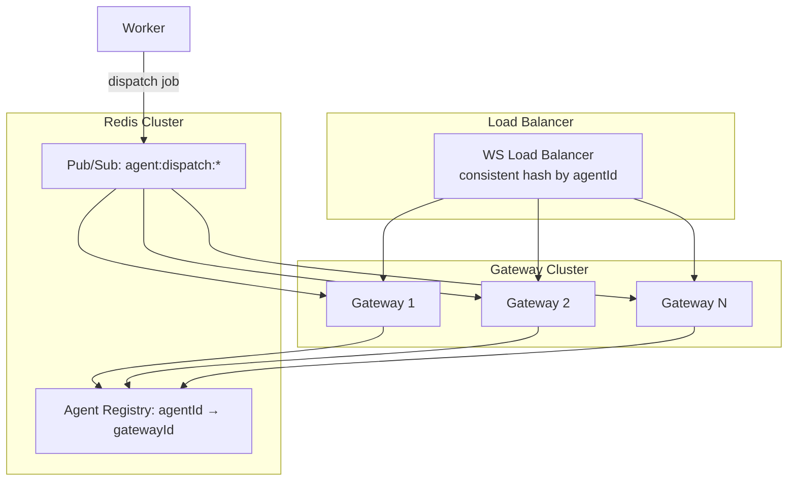

**Consistent hashing:** `agentId → gateway instance` ensures reconnecting agents hit the same instance (reduces connection churn). On gateway failure, agents redistribute via health check.

### 16.4 Metrics at Scale

| Scale | Strategy |
|-------|----------|
| 100 | Raw `agent_metrics` in PostgreSQL, daily partition |
| 1,000 | Hourly rollups after 24h; TimescaleDB extension |
| 10,000 | TimescaleDB continuous aggregates; 1min → 1hr → 1day; S3 archive > 90 days |

### 16.5 Investigation Concurrency

| Scale | Max Concurrent Investigations | Strategy |
|-------|----------------------------|----------|
| 100 | 10 | Single worker, in-process |
| 1,000 | 50 | Worker pool, BullMQ concurrency per queue |
| 10,000 | 200+ | Dedicated investigation worker fleet; LLM request queuing; agent command rate limiting (1 concurrent command per agent) |

### 16.6 CDN & Agent Distribution

- **Binary hosting:** Cloudflare R2 / S3 + CloudFront
- **Install script:** `agent.argusops.ai/install.sh` (versioned, checksums)
- **Auto-update:** Agent checks `GET /agent/version` daily; optional `auto_update: true` in config
- **Release channels:** `stable`, `beta` (opt-in)

---

## Appendix A: OAuth Provider Configuration

### GitHub OAuth App

| Setting | Value |
|---------|-------|
| Authorization callback URL | `https://app.argusops.ai/api/oauth/github/callback` |
| Scopes | `repo`, `read:org`, `read:user` |
| Token expiration | Enable refresh tokens (expiring user tokens) |

### GitLab OAuth App

| Setting | Value |
|---------|-------|
| Redirect URI | `https://app.argusops.ai/api/oauth/gitlab/callback` |
| Scopes | `read_api`, `read_repository` |

### Bitbucket OAuth

| Setting | Value |
|---------|-------|
| Callback URL | `https://app.argusops.ai/api/oauth/bitbucket/callback` |
| Scopes | `repository`, `account` |

---

## Appendix B: Environment Variables (New)

```bash
# OAuth
GITHUB_OAUTH_CLIENT_ID=
GITHUB_OAUTH_CLIENT_SECRET=
GITLAB_OAUTH_CLIENT_ID=
GITLAB_OAUTH_CLIENT_SECRET=
BITBUCKET_OAUTH_CLIENT_ID=
BITBUCKET_OAUTH_CLIENT_SECRET=
OAUTH_STATE_SECRET=

# Agent
AGENT_JWT_SECRET=
AGENT_TOKEN_EXPIRY_HOURS=24
AGENT_JWT_TTL_DAYS=30
AGENT_INSTALL_URL=https://agent.argusops.ai/install.sh

# Agent Gateway
AGENT_WS_PORT=4001
AGENT_HEARTBEAT_TIMEOUT_SEC=90

# Redis
REDIS_URL=redis://localhost:6379

# Feature Flags
FF_OAUTH_GITHUB=true
FF_OAUTH_GITLAB=false
FF_OAUTH_BITBUCKET=false
FF_AGENT_INFRA=true
FF_SSH_VPS=true
```

---

## Appendix C: Glossary

| Term | Definition |
|------|------------|
| **Agent** | Go binary installed on customer servers; executes whitelisted commands |
| **Agent Token** | One-time registration token; hashed server-side |
| **Agent Gateway** | WebSocket server managing persistent agent connections |
| **Investigation** | User-initiated analysis correlating repo + infrastructure data |
| **Repository Integration** | OAuth connection to a source control provider |
| **Provider** | Implementation of `RepositoryProvider` for a specific VCS |
| **Control Plane** | ArgusOps backend (API + Worker + Gateway) |

---

*End of Architecture Specification v2.0*
